# Think & Test Quiz

Welcome to the Think & Test Quiz! This interactive quiz assesses your knowledge with 15 questions in 30 seconds. Your grade depends on how many answers you get right. With a pool of over 30 questions, users can enjoy a fresh experience every time they take the quiz.

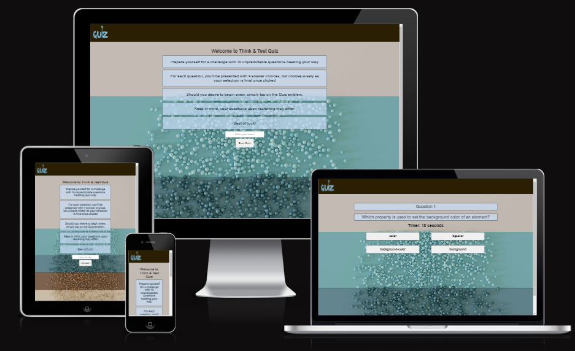

## Contents

### User Experience (UX)

- __Initial Discussion__
- __User Stories__

### Structure

- __Home Page Section__
- __Questions Page Section__
- __Scores Section__

### Design

- __Colour Scheme__
- __Typography__
- __Images__
- __Wireframes__
- __Features__
- __Accessibility__

### Technologies Used

- __Languages Used__
- __Frameworks, Libraries and Programs used__

### Deployment
- __Deployment__

### Testing
- __W3C Validator__
- __Navigation Links__
- __Responsive Design__

### Credits

- __Code Used__
- __Media__
- __Content__
- __Acknowledgments__

## User Experience (UX)

- __Initial Discussion__
Think & Test Quiz is an engaging quiz focusing on HTML and CSS knowledge. It features 15 randomly selected questions from a pool of over 30, ensuring players always have a fresh experience.
#### Important Details About the Website
- entertain players with the quiz
- provide correct answers for learning
- foster internal competition
- ensure compatibility across all devices
- this project was created using HTML, CSS, and JavaScript

#### User Stories
Goals for First-Time Users:
- I want to know what the website is for and how to use it.
- I want the game to be easy to play.
- I want to see the right answers.
- I want to know my score.
- I want to move around the website easily.
- I want to have fun.
    #### Goals for Returning Users:
    - I'd like to have a variety of questions each time I play, with no repeats.
    - I want to enjoy playing the game again and again.
    #### Goal for All Users:
    - Every user desires the website to be easily accessible and user-friendly on various devices.

## Structure

 
The quiz platform comprises an instructions page, 15 questions, and a results page. Users can opt to retake the quiz from the results page, which redirects them to the 15 questions. Additionally, users can restart the quiz at any time by clicking on Quiz logo in the top left corner.

 

- __Home Page__
    - Provides insight into the game's nature.
    - Guides users on how to play.
    - Encourages users to begin.
 

User Goals:
- Understand the website's primary purpose.
- Grasp the gameplay mechanics.
- Initiate the game.
- Experience amusement.

 

Website Goals:
- Captivate and engage users.
- Clarify gameplay mechanics.
- Facilitate game initiation.

- __Questions Page Section__
    - Presents questions with four answer options within a 30-second timeframe to encourage prompt responses.
    - Displays the next question button upon answer selection.
    - Indicates correct/incorrect answers.
    - Tracks question count out of fourty.

 

User Goals:
- Engage in the quiz.
- Identify the correct answer, even when selecting the wrong one, with adequate viewing time.

 

Website Goals:
- Entertain users through the quiz.
- Enable seamless navigation to the subsequent question.
- Implement a timer for each question to add excitement and urgency.
- Provide a question counter.
- Present correct answers.

- __Score Section__
- Exhibits the user's score out of 15.
- Offers the option to replay.

 

User Goals:
- Discover the number of correct answers.
- Experience amusement.
- Have the chance to replay.

 

Website Goals:
- Inform users of their correct answer count.
- Facilitate quiz replayability.

## Design
### Color Palette
The color scheme was generated using the Contrast Grid website.

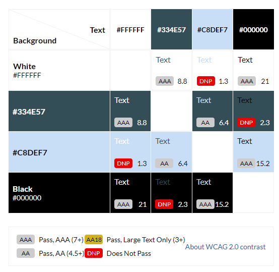

### Typography

#### The fonts for this website were sourced from Google Fonts and Adop Fonts:
- "Truculenta", sans-serif was chosen for all questions and answers.
- Arial, sans-serif was selected for all headings and other paragraphs.

### Images

The background image and logo used in this quiz were sourced from www.pexels.com, ensuring they are free from any copyright issues.

### Wireframes

Wireframes were created for desktop.

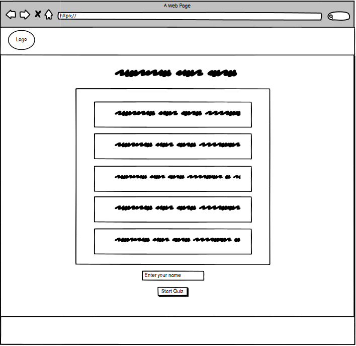

 

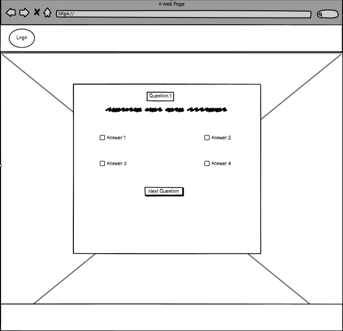

 

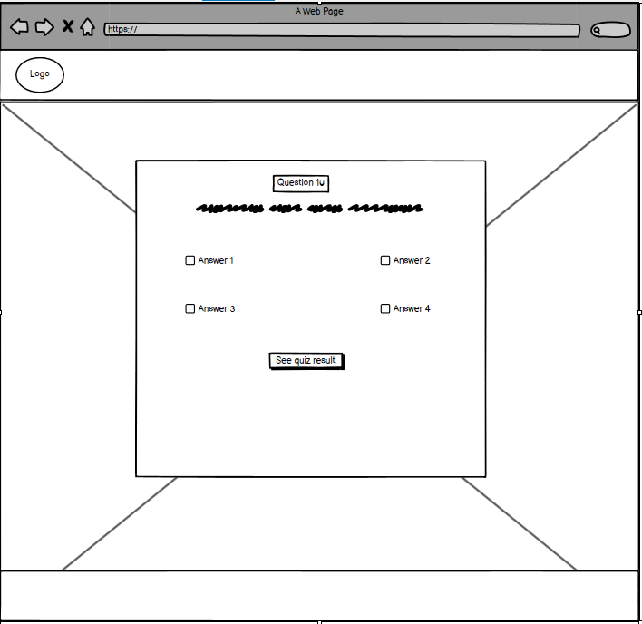

 

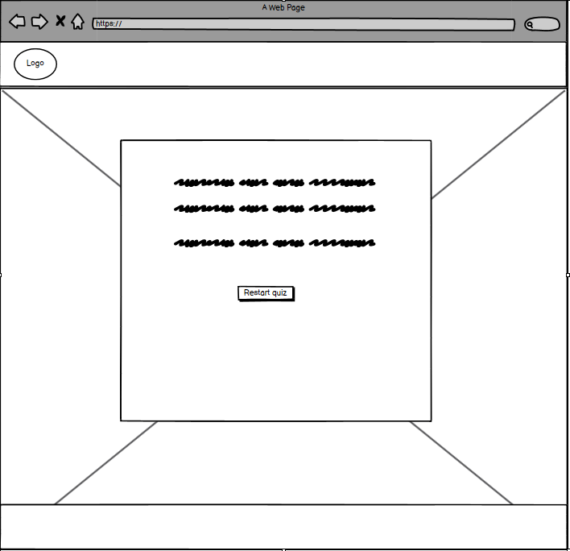

### Features

- __Home Page__
    - The logo serves as a consistent link to the home page across all website pages, ensuring easy navigation.
    - By clicking on the logo, users can return to the home page at any point during the game.
    - Hovering over the logo displays a title, reinforcing its function as a link.

- __Instructions area__
    - The instructions section is prominently displayed, capturing the user's attention from the outset.
    - It features a text input box for users to enter their name, which will be utilized for the results.
    - Clear explanations are provided regarding the nature of the quiz, including the number of questions, how to answer them, and the inability to change responses after submission.
    - Instructions also outline the process for restarting the quiz, with a reminder that questions may vary.
    - Each question is timed for 30 seconds, adding an element of urgency.
    - The start button is prominently positioned and visually emphasized, facilitating the initiation of the quiz.

 

- __Questions section__
    - Within this area, users encounter the 15 questions, clearly indicating their progress.
    - Each question is prominently displayed, ensuring easy readability.
    - Four options are presented for each question, allowing users to make their selection.
    - A timer is prominently featured above the answer choices, adding a sense of urgency.
    - The spacing between buttons is optimized to minimize the risk of accidental clicks.
    - The layout is responsive, adjusting to larger devices by organizing buttons into a convenient 2 x 2 grid.

    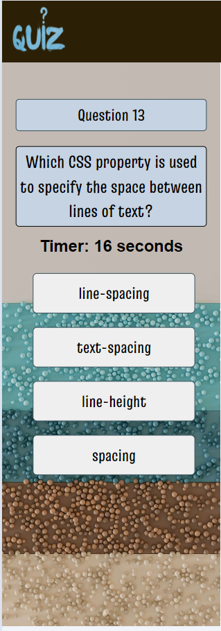

     

    - __Correct and Incorrect answers__
        - After selecting an answer, buttons dynamically change color to indicate correctness.
        - The next button becomes visible for progression.
        - A timer prompts players to make a swift decision, enhancing engagement.

        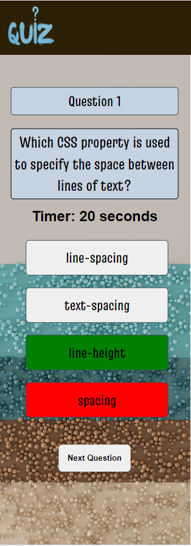

     

    - __Results section__
        - Extracts user's name from the input field in the instructions.
        - Personalizes the results page by displaying the user's name.
        - Provides the user's score out of 15.
        - Offers an option to restart the quiz for further enjoyment.
        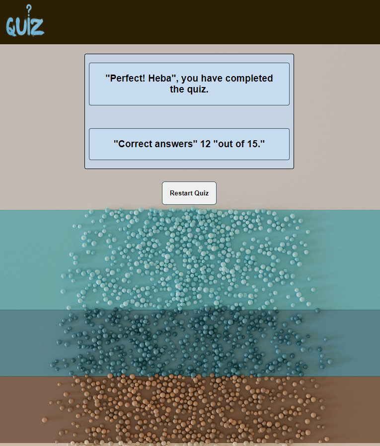

         

        ### Accessibility
        - Implemented active tags to indicate the current open page for screen reader users.
        - Incorporated ARIA labels on all images throughout the website to provide descriptive information to screen reader users.
        - Enhanced user engagement and reduced errors by implementing button highlighting in beige when hovered over.
        - Incorporated a feature where, upon selecting an answer, the correct answer is revealed, followed by the display of a button for proceeding to the next question. This prevents users from accidentally skipping questions and enables them to review both correct and incorrect answers.
        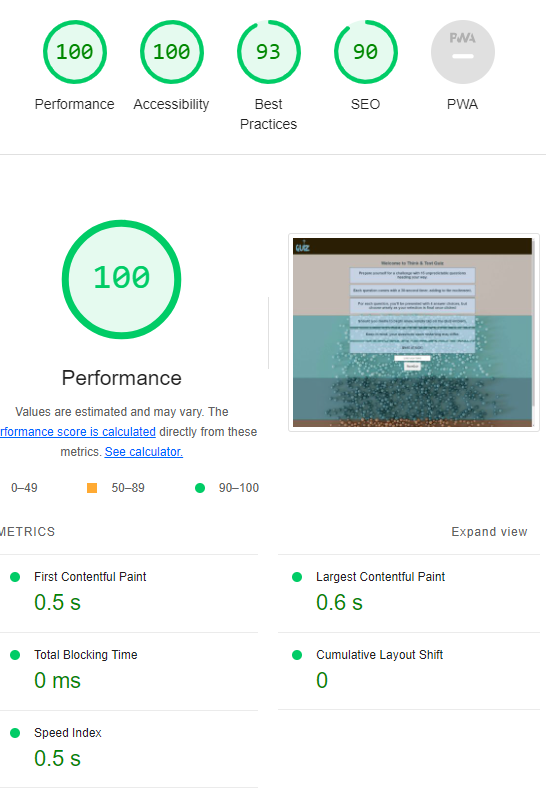

     
    
    ## Technologies Used

    - Languages: HTML, CSS, JavaScript.
    - Git - For version control.
    - GitHub - To save and store the files for the website.
    - Gitpod - IDE to develop the website.
    - Google Fonts - To import the fonts used on the wesbite.
    - Google Chrome Dev Tools- For addressing technical issues, debugging, inspecting elements on the page, and ensuring responsiveness, as well as resolving any associated styling problems.
    - Favicon.io - to create the website favicon.
    - Google Chrome's Lighthouse - to access preformance and accesibility.
    - W3C HTML Markup Validator to validate HTML code.
    - W3C Jigsaw CSS Validator to validate CSS code.
    
     

    ## Deployment

    - __The website has been deployed to GitHub Pages. Follow these steps to deploy it:__
        - Go to the Settings tab in the GitHub repository.
        - In the Source section drop-down menu, choose the Master Branch.
        - Once you've selected the master branch, the page will automatically refresh, showing a detailed ribbon display to confirm the successful deployment.
        - You can access the live link here
        https://hebaabdulal.github.io/think-test-quiz/index.html

         

    ## Testing

    - __User Stories__

| Feature                   | First-time Users                                 | Frequently Users                                 | All Users                                 | Result  |
|---------------------------|--------------------------------------------------|--------------------------------------------------|------------------------------------------|---------|
| Logo Link                 | As a first-time user, I expect the logo to be clickable, directing me to the home page.        | As a frequent user, I rely on the logo link for quick navigation to the home page.                   | All users expect the logo to serve as a consistent navigation element throughout the website. | Passed    |
| Quiz Instructions         | I expect clear instructions on how to play the quiz, including how many questions there are and how to start. | As a frequent user, I may skip the instructions, but I expect them to be easily accessible.             | All users need instructions to understand how to interact with the quiz.                      | Passed    |
| Question Display          | I expect the questions to be displayed clearly and prominently on the screen.                         | As a frequent user, I expect the questions to be presented consistently and legibly.                    | All users rely on the clear display of questions to participate in the quiz.                  | Passed    |
| Answer Selection          | I expect to be able to select answers easily and intuitively.                                         | As a frequent user, I expect the answer buttons to be responsive and accurately register my selection. | All users need an intuitive interface for selecting answers during the quiz.                 | Passed    |
| Timer Display             | I expect to see a timer indicating the time remaining for each question.                                | As a frequent user, I rely on the timer to pace my answers during the quiz.                          | All users need a timer to track their progress and performance in the quiz.                  | Passed   |
| Results Presentation      | After completing the quiz, I expect to see my score and performance summary.                             | As a frequent user, I expect the results page to provide detailed feedback on my performance.          | All users need clear and informative feedback on their quiz results.                         | Passed    |
| Navigation and Restart    | I expect clear navigation options to restart the quiz or navigate between questions.                    | As a frequent user, I rely on smooth navigation to move through the quiz efficiently.                 | All users need intuitive navigation options to navigate the quiz.                           | Passed    |

 

- __Manual Testing__

| Functionality                                          | Test Description                                                                                     | Test Result  |
|--------------------------------------------------------|-----------------------------------------------------------------------------------------------------|--------------|
| Answer Feedback Coloring                               | Selected each answer to check if color changes to green for correct and red for incorrect answers. | Passed       |
| Timer Functionality                                    | Waited without selecting any answer to see if timer proceeds to the next question or shows results. | Passed       |
| Random Question Display                                | Verified if questions are displayed randomly.                                                       | Passed       |
| Alert Message for Missing or Invalid User Name        | Attempted to submit without providing a name or providing only spaces to check for alert message.   | Passed       |
| Result Button Functionality for Score Display         | Clicked on the result button to ensure that scores are shown after completing the quiz.             | Passed       |

 

- __Html validation__

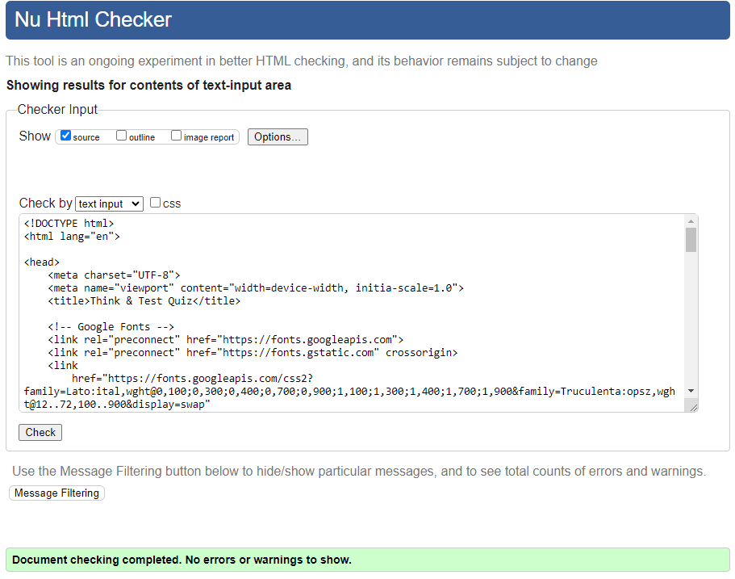

 

- __CSS validator__

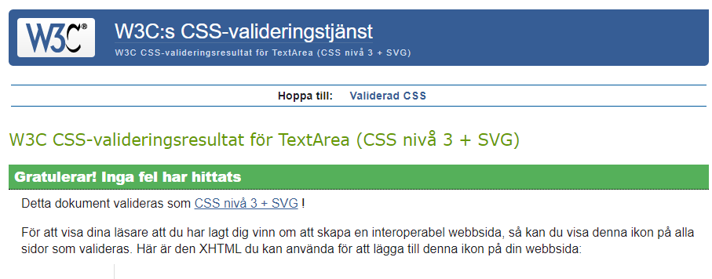

 

## Credits
- Html
- CSS
- Javascript

### Media

- The website incorporated image and logo sourced from www.pexels.com, was utilized during development. The Google Chrome browser was used for testing and previewing.

### Content

- Content for the website is written by the owner Heba Abdulal.

### Acknowledgments

I would like to thank Matt Bodden, my mentor from Code Institute, for his guidance and support during the development of my second milestone project.

